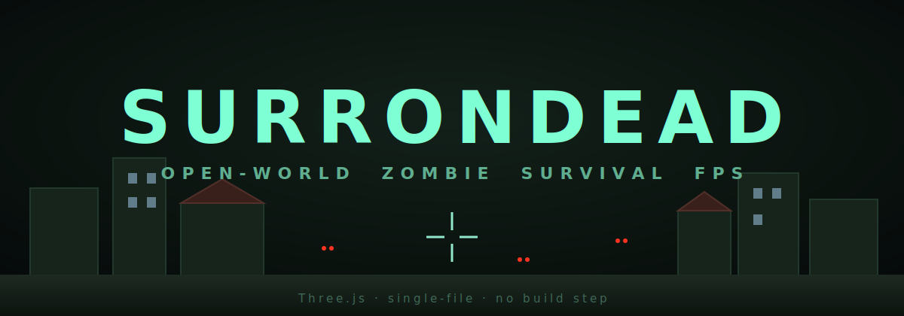

# SURRONDEAD



**An open-world zombie-survival FPS that runs entirely in your browser — a single HTML file, no build step, no install.** Built with [Three.js](https://threejs.org/).

You wake in a dead town with nothing but a knife. The infected own the streets now. Search crates and houses, armor up, feed yourself, claim a home base, and survive the night.

---

## ▶ Play

- **Play in your browser:** **https://andrewvbro.github.io/surrondead/**
- **Download to play offline:** grab the latest [**Release**](https://github.com/andrewvbro/surrondead/releases/latest) — unzip and double-click `run.bat` (Windows) or `run.sh` (Mac/Linux).

> Tip: click the game window to capture the mouse. Press `Esc` to free it.

---

## Features

- **Procedural town** — a 5×5 block grid of houses, stores, garages, warehouses, apartments, plus a HOTEL landmark, gas station, diner, police station, and a fenced **military base**.
- **Gunplay & melee** — knife, machete, fire axe, bat, pistol, revolver, SMG, rifle, hunting rifle, shotgun, and a craftable **bow**. Each has a custom first-person viewmodel, aiming (ADS), reloads, and headshots. *Shooting is loud and attracts zombies — the bow is near-silent.*
- **Loot & scavenging** — 20+ container types with timed searching; **safes and car trunks** have a lockpick/hotwire **minigame** (botch the trunk and the alarm summons a swarm).
- **Survival systems** — health, stamina, hunger, and (on Hard) **thirst**; food, water, bandages, medkits, and painkillers.
- **Gear & inventory** — slot-based backpack with item footprints; 8 equipment slots; clothing/armor that adds carry space and damage mitigation that wears down.
- **Crafting** — workbench recipes for ammo, armor, clothing, medicine, the bow & arrows, and base-building structures.
- **Base building** — walls, doors, floors, barricades, spike traps, campfires (that cast warm light), workbenches, and **slot-grid stash boxes**. **Claim any building as your home base** (`B`) to set your respawn.
- **Day/night cycle** with nightly waves and, on Hard, roaming **hordes** that sweep across the map.
- **Zombie variety** — walkers, runners, night wanderers, heavy armored guards, crawlers, brutes, and screamers.
- **Difficulty modes** — Normal and Hard (scarcer loot, thirst, weapon durability, extra zombie types, hordes).
- **Recycler** at the military base — break down unwanted gear into raw resources.
- **3 save slots** — saves your character, loot, structures, and stash contents (the world is seeded so it regenerates identically on load).
- **Settings** — mouse sensitivity, master volume, field of view, invert-look.
- **Synth audio** — all sound effects are generated procedurally with the Web Audio API (no audio files).

---

## Controls

| Key | Action |
| --- | --- |
| `W A S D` | Move |
| `Shift` | Sprint |
| `Space` | Jump |
| `Mouse` | Look |
| `Left click` | Attack / shoot |
| `Right click` | Aim down sights |
| `R` | Reload |
| `E` | Search / loot / interact |
| `1` `2` `3` | Primary · Secondary · Melee |
| `4` `5` `6` | Quick-use Med · Food · Water |
| `F` | Quick-heal |
| `Tab` / `I` | Gear & backpack |
| `C` | Crafting |
| `M` | Map |
| `L` | Flashlight |
| `B` | Claim building as home base |
| `P` | Save / load menu |
| `Esc` | Close menu / free mouse |

---

## Run it locally

The game is one file (`index.html`) that loads Three.js from a CDN, so it needs to be served over HTTP (not opened directly as a `file://`).

**Node:**
```bash
node server.js
# then open http://localhost:5680
```

**Python:**
```bash
python -m http.server 5680
# then open http://localhost:5680
```

Or just use the `run.bat` / `run.sh` launcher included in the downloadable release.

---

## Tech

- [Three.js](https://threejs.org/) r0.160 via ES-module import map (loaded from unpkg — no `node_modules`, no bundler).
- Pure vanilla JavaScript, HTML, and CSS in a single ~3,000-line file.
- Web Audio API for all sound.

---

## License

[MIT](LICENSE) — do whatever you like. Built for fun.
